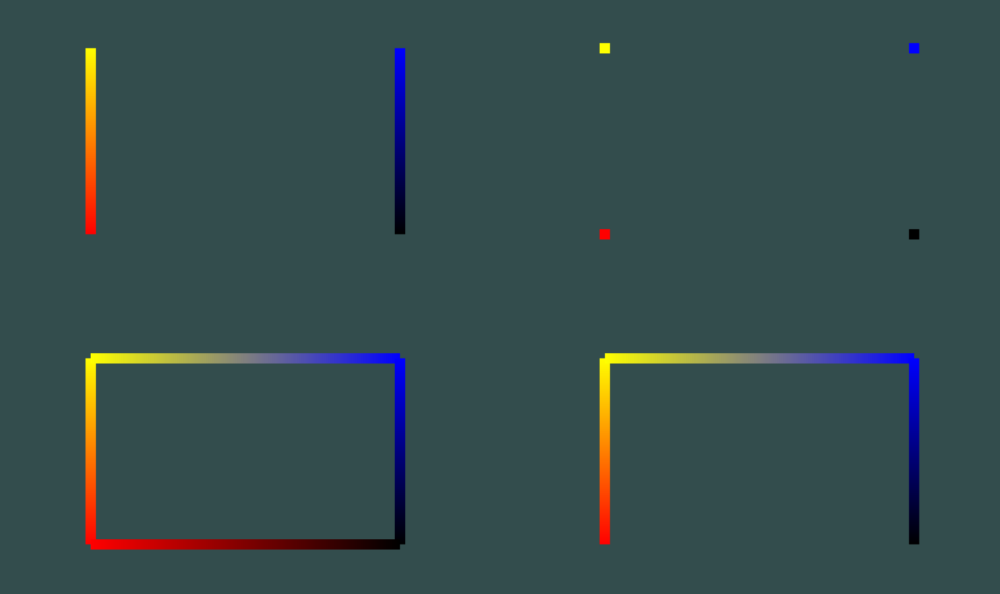
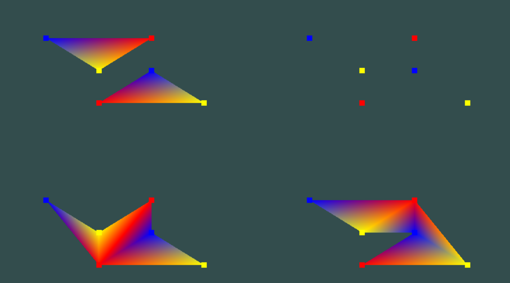

# Curs 2 - Primitive
Exemplele se gasesc in ```include/fmi/02-*```
## Moduri de desenare pentru linii
**include/fmi/02-01-lines/LineApp.h**



- dreapta sus: GL_POINTS
- stanga sus: GL_LINES
- stanga jos: GL_LINE_LOOP
- dreapta jos: GL_LINE_STRIP

## Moduri de desenare pentru triunghiuri
**include/fmi/02-02-triangles/TriangleApp.h**



- dreapta sus: GL_POINTS
- stanga sus: GL_TRIANGLES
- stanga jos: GL_TRIANGLE_FAN
- dreapta jos: GL_TRIANGLE_STRIP